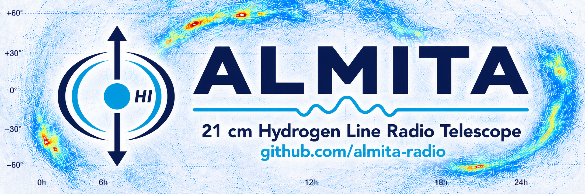

<p align="center">
  
</p>
**Antenna Listening Mostly to Interference, Tentatively Astronomy**

ALMITA is an amateur 21 cm hydrogen line radio telescope project created by **Felipe Fridman G.**

The project observes the neutral hydrogen line at **1420.405 MHz** using accessible hardware, Python software, INDI/OnStep mount control, SDR acquisition, temperature-aware calibration, HDF5 storage and post-processing tools for spectra and simple hydrogen map generation.

ALMITA was mostly vibe-coded, field-tested and debugged through RF suffering. It is built in the spirit of amateur radio astronomy: modest hardware, careful measurements, stubborn iteration and a sincere attempt to listen to the Galaxy.

---

## What ALMITA does

ALMITA automates basic hydrogen line radio observations.

It can:

* Generate observation plans over a selected sky region.
* Control an equatorial mount through **INDI** and **OnStep**.
* Capture I/Q samples using an SDR receiver.
* Store raw observations and metadata in **HDF5**.
* Record pointing information such as RA, Dec, altitude, azimuth and timestamp.
* Store observatory coordinates in the observation metadata.
* Measure and store LNA and SDR temperatures.
* Support hot sky, cold sky and 50 ohm calibration references.
* Apply calibration and temperature correction during spectrum processing.
* Generate spectra from recorded I/Q data.
* Plot spectra with and without interpolation.
* Build image-like hydrogen maps from multiple pointings.
* Provide command-line operation with a lightweight web monitoring interface.

---

## Hardware

The current ALMITA setup uses:

* **Raspberry Pi 5**
* **SDR V4**
* **Nooelec Hydrogen LNA**
* Custom 1420 MHz feed for the 21 cm line
* Modified **2.4 GHz WiFi grid/parabolic antenna**, approximately **90 × 60 cm**
* **Meade EQ5 equatorial mount**
* **OnStep** mount controller
* **INDI Server** for mount communication
* Ferrite chokes and short RF cabling near the feed
* Temperature sensors for LNA and SDR monitoring
* 50 ohm reference load for calibration

The hardware is intentionally accessible and experimental. This is not a commercial radio telescope kit.

---

## Software stack

ALMITA is mainly written in **Python** and runs inside a Python virtual environment.

Main components:

* Python
* INDI / PyINDI
* OnStep
* SDR capture tooling
* NumPy
* Astropy
* h5py / HDF5
* Local hydrogen map/catalog database
* HIPASS-derived catalog/map resources where applicable
* Command-line tools
* Lightweight web monitoring interface

---

## Installation

Create and activate a virtual environment:

```bash
python3 -m venv .venv
source .venv/bin/activate
```

Install Python dependencies:

```bash
pip install -r requirements.txt
```

INDI Server, OnStep support and SDR system packages must be installed separately according to the operating system and hardware.

Example:

```bash
sudo apt install indi-full
```

Additional SDR packages may be required depending on the receiver used.

---

## Basic workflow

A typical ALMITA session works like this:

1. Start INDI Server.
2. Connect the OnStep-controlled Meade EQ5 mount.
3. Generate or load an observation plan.
4. Move the antenna through the planned sky positions.
5. Capture I/Q data at each pointing.
6. Record pointing metadata, observatory coordinates and temperature readings.
7. Store each observation in HDF5.
8. Monitor the session from the web interface.
9. Process the captured files offline.
10. Apply calibration and temperature correction.
11. Generate spectra and hydrogen maps.

Example capture command:

```bash
python scripts/hi_capture.py --ra <RA> --dec <DEC> --duration <seconds> --output data/
```

Example planned session:

```bash
source .venv/bin/activate

python scripts/generate_plan.py \
  --center-ra <RA> \
  --center-dec <DEC> \
  --width-deg <WIDTH> \
  --height-deg <HEIGHT> \
  --points <N> \
  --output plans/session_plan.csv

python scripts/capture.py \
  --plan plans/session_plan.csv \
  --output data/session_001/
```

Command names and parameters may change as the project evolves.

---

## Calibration and temperature correction

ALMITA supports a practical amateur calibration workflow using:

* Hot sky reference
* Cold sky reference
* 50 ohm load reference
* LNA temperature
* SDR temperature

Calibration is mainly applied during post-processing. Raw captures are stored with enough metadata to allow later correction, comparison and reprocessing.

The processing chain generally includes:

1. Load I/Q data from HDF5.
2. Calculate the power spectrum.
3. Apply hot/cold/50 ohm calibration references.
4. Apply temperature-related correction when available.
5. Generate raw and corrected spectra.
6. Plot spectra with and without interpolation.
7. Build image-like maps from the observation grid.

---

## HDF5 data format

Each capture is stored as an HDF5 file.

A typical file contains:

* I/Q complex samples
* Timestamp
* Frequency configuration
* Sample rate
* Gain settings
* RA / Dec
* Altitude / azimuth
* Observatory latitude / longitude / elevation
* Mount metadata
* LNA and SDR temperatures
* Calibration metadata
* Session information

The main I/Q dataset is stored as:

```text
/iq
```

Example conceptual structure:

```text
observation_001.h5
├── /iq
└── attributes
    ├── ra
    ├── dec
    ├── alt
    ├── az
    ├── observatory_latitude
    ├── observatory_longitude
    ├── observatory_elevation_m
    ├── timestamp_utc
    ├── center_frequency_hz
    ├── sample_rate
    ├── gain
    ├── lna_temperature
    ├── sdr_temperature
    ├── calibration_type
    └── session_id
```

---

## Hydrogen catalog / map database

ALMITA uses a local hydrogen map/catalog database to support observation planning, calibration and comparison against known HI regions.

The current concept includes locally stored HI survey/catalog information, including HIPASS-derived resources where applicable.

This helps select useful sky regions, compare expected hydrogen emission and support future pointing and calibration workflows.

---

## Web monitoring interface

ALMITA is operated mainly from the command line, but includes a lightweight web monitoring interface for:

* Current capture status
* Active target
* Mount position
* Session progress
* Recent files
* Temperature readings
* Basic SDR/LNA state
* Observation grid progress

The web interface is a monitoring layer, not a replacement for the command-line workflow.

---

## Project status

ALMITA is an amateur experimental project under active development.

Current goals:

* Reliable 21 cm capture
* Stable mount control through INDI and OnStep
* Repeatable HDF5 data format
* Observatory coordinate metadata
* Temperature recording
* Hot/cold/50 ohm calibration
* Temperature-aware spectrum correction
* Local hydrogen catalog integration
* Spectra plotting with and without interpolation
* Simple hydrogen map generation
* Documentation good enough for other amateur radio astronomy humans to reproduce the system

---

## Disclaimer

This software is provided **as is**, with **no warranty**, **no guarantee** and **no formal support**.

It may contain bugs, wrong assumptions, incomplete documentation, unstable interfaces, questionable RF wisdom, calibration mistakes, broken scripts and traces of late-night debugging.

Use it at your own risk.

ALMITA is not intended for professional observatory operations, safety-critical systems, commercial use or any situation where failure could cause damage, injury, data loss, financial loss or excessive sadness.

This is an amateur radio astronomy project built for learning, experimentation, reproducibility and fun.

---

## License

License to be defined.

A permissive open-source license such as MIT, BSD-3-Clause or Apache-2.0 is recommended if the goal is to allow others to use, modify and share the code.

---

## Author

Created by **Felipe Fridman G.**

Mostly vibe-coded, field-tested, calibrated with patience and built for amateur hydrogen line radio astronomy.

---

## Repository

Project home:

```text
github.com/almita-radio
```

Public code is intended to represent the stable, cleaned-up version of the project.

Development history, experiments and unstable work may live separately in private repositories.
