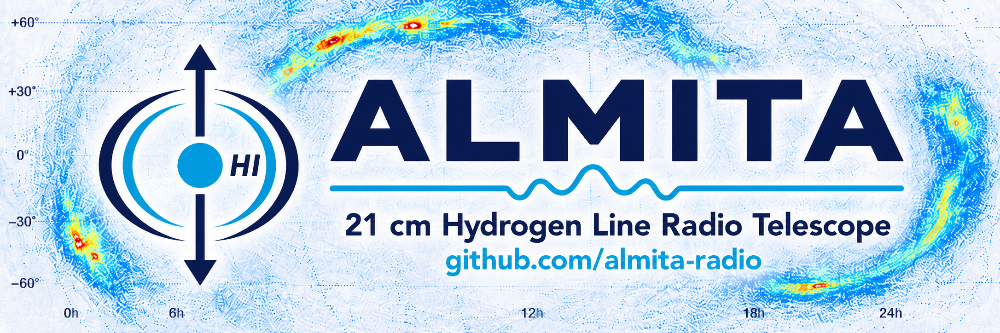

<p align="center">
  
</p>

# ALMITA

**Antenna Listening Mostly to Interference, Tentatively Astronomy**

ALMITA is an amateur 21 cm neutral hydrogen radio telescope built by **Felipe Fridman G.**

It combines accessible RF hardware, a Raspberry Pi 5, RTL-SDR receivers, INDI/OnStep mount control, automated sky grids, HDF5 acquisition, live quicklook products and a lightweight web console.

The goal is simple:

> point at the Galaxy, record what the hardware actually saw, and avoid lying to ourselves about the parts we have not calibrated yet.

Mostly vibe-coded. Extensively tested. Occasionally threatened with a hammer.

---

## What it does

ALMITA can:

- Generate physically consistent sky mosaics from beam width, sampling and angular field size.
- Plan observations in equatorial coordinates.
- Control an equatorial mount through **INDI + OnStep**.
- Acquire raw I/Q data from an **RTL-SDR Blog V4**.
- Store observations and metadata in **HDF5**.
- Record RA, Dec, altitude, azimuth, UTC time and observatory coordinates.
- Record SDR and LNA temperatures.
- Keep SDR gain fixed during an observation for repeatable measurements.
- Generate live **Spectrum**, **Waterfall** and sky-map quicklooks.
- Monitor running sessions through a local web console.
- Operate completely offline in the field.
- Preserve raw observations for later reprocessing.

ALMITA currently treats HI intensity as a **relative/instrumental measurement**. Absolute calibration in Kelvin is a development goal, not a currently claimed capability.

---

## Current hardware

- **Raspberry Pi 5**
- **RTL-SDR Blog V4** — primary science receiver
- **RTL-SDR V3** — secondary RFI reference receiver
- **Nooelec Hydrogen LNA**
- 1420 MHz feed
- Modified ~90 × 60 cm WiFi grid/parabolic reflector
- Equatorial mount
- **OnStep** controller
- **INDI**
- LNA and SDR temperature sensors
- Local 50 Ω RF reference loads
- Experimental 1420 MHz RFI-monitor dipole

The secondary SDR is being developed as an independent RFI monitor so ALMITA can ask an important scientific question:

> “Is that hydrogen, or did somebody turn on another horrible electronic device nearby?”

---

## Software

ALMITA is mainly Python and runs locally on the Raspberry Pi.

Core technologies include:

- Python
- NumPy
- Astropy
- h5py / HDF5
- INDI / PyINDI
- OnStep
- rtl_tcp
- Matplotlib
- systemd
- local web monitoring
- local HI sky reference data

No cloud connection is required for observation.

---

## Observation workflow

A typical session is:

1. Start the mount and SDR services.
2. Generate an observation grid.
3. Verify visibility and RF conditions.
4. Select and freeze SDR gain.
5. Start acquisition.
6. Move through the planned sky positions.
7. Store raw I/Q and metadata in HDF5.
8. Generate live quicklook products.
9. Monitor progress from the ALMITA Console.
10. Process and compare observations offline.

The science receiver remains the primary data source. Auxiliary monitoring must never block or interfere with the main capture path.

---

## Grid Generator

The grid system is based on real angular geometry rather than an arbitrary point count.

The current design supports or is evolving toward three main planning modes:

- **EQUATORIAL_RECT**
- **EQUATORIAL_ROTATED**
- **GALACTIC_RECT**

Future observation planning will include Galactic strip/scan modes for longitudinal and transverse HI surveys.

Galactic plans are intended to generate multiple views:

- Galactic coordinates — for understanding the science.
- Equatorial coordinates — for understanding what the mount will execute.
- Local observer sky projection — for understanding what the field actually looks like from the ground.

A local HI dataset can be used as a visual planning background.

One particularly important future campaign has an unofficial scientific name:

**the little Milky Way arm survey.**

---

## RFI reference receiver

ALMITA is adding a second RTL-SDR receiver dedicated to monitoring the local RF environment.

Planned architecture:

```text
MAIN
RTL-SDR V4
→ science antenna
→ full capture
→ HDF5

RFI_REF
RTL-SDR V3
→ small 1420 MHz dipole
→ lightweight FFT monitoring
→ RFI diagnostics
